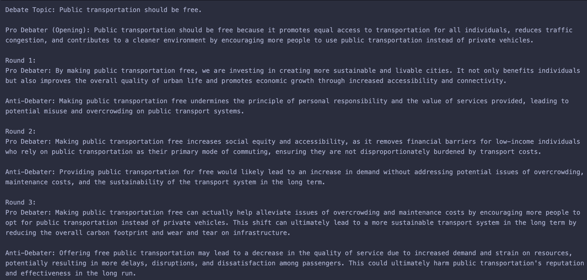

# LLM_project

## Task 1: Monte Carlo Tree Search (MCTS) for LLM-Based Reasoning

For this part, ChatGPT API is utilized alongside Monte Carlo Tree Search in order to solve the zebra puzzle. 

For this iteration of the zebra puzzle, the following attributes and respective values are possible:

* COLOR: red, green, ivory, yellow, blue
* NATIONALITY: Englishman, Spaniard, Ukrainian, Norwegian, Japanese
* PET: dog, snail, fox, horse, zebra
* DRINK: coffee, tea, milk, orange juice, water
* HOBBY: dancing, painting, reading, football, chess

Each of these value must be used once and all five attributes need to be given to five houses. It is important to note that the combination must satisfy all 15 conditions shown below. 

The following conditions are supplied for this zebra puzzle are: 

1. There are five houses.
2. The Englishman lives in the red house.
3. The Spaniard owns the dog.
4. The person in the green house drinks coffee.
5. The Ukrainian drinks tea.
6. The green house is immediately to the right of the ivory house.
7. The snail owner likes to go dancing.
8. The person in the yellow house is a painter.
9. The person in the middle house drinks milk.
10. The Norwegian lives in the first house.
11. The person who enjoys reading lives in the house next to the person with the fox.
12. The painter's house is next to the house with the horse.
13. The person who plays football drinks orange juice.
14. The Japanese person plays chess.
15. The Norwegian lives next to the blue house.

The ChatGPT API is used to generate different combinations of the attributes' values. 

In order to solve the puzzle itself, the MCTS approach is incorporated. 

The Monte Carlo Tree Search (MCTS) approach used here operates through four main stages: selection, expansion, simulation, and backpropagation. In the selection phase, the algorithm starts at the root node and recursively chooses child nodes with the highest UCB (Upper Confidence Bound) score, guiding it toward promising areas of the search space. Once it reaches a node that isn’t fully expanded, the expansion phase adds a new child node by applying one of the remaining legal moves to the current state. The simulation phase then uses ChatGPT to complete the rest of the puzzle from this partially filled state, attempting to satisfy all constraints. After simulation, the algorithm enters the backpropagation phase, where it updates visit counts and cumulative scores from the leaf node back up to the root. This iterative process builds a search tree that helps identify the most promising sequences of decisions based on how well each completed state satisfies the Zebra Puzzle conditions.

The second technique used to solve the provided Zebra Puzzle is the Constraint Satisfaction Problem (CSP).  For each attribute category, the code uses the "python-constraint" library to create variables corresponding to each possible attribute value.  For example, variables will be things such as 'color_red' or 'pet_dog'. These variables are constrained to take a particular whole number value from 1 to 5, which represents the positions of each of the fives houses. The 'AllDifferentConstraint' is applied within each attribute group to ensure that no value are repeated. The code also defines a list of logical constraints that relate positions of different attribute values, for example, whether one house is next to another or immediately to its right. The 'solve_csp' function builds the CSP, applies the constraints, and solves it using the constraint solver. It returns the accuracy percentage of how many of the conditions were satisfied and how long it took to reach the solution.

The third technique is to use a complete backtracking algorithm, which is a more-intelligent version of the brute force method.
The 'count_constraints' function totals up how many of the conditions are satisfied and 'check_arrangement' goes through each of the conditions one by one to see if the specific combination meets all the 15 conditions. The 'backtrack_solver' is the one that goes through each of the possible combinations of values for each house's attributes. If even a single condition is not met, the algorithm terminates that combination and backtracks to create another option. This process, while it does try and go through all possible combinations, is more intelligent than that because it is able to diagnose if a condition is violated and terminate that line of thinking immediately to try another option. The highest score of the combination that satisfied the most conditions is then stored and then divided by 15 to get the percentage value. Also, the time it takes to arrive at the solution is also documented. 

To compare and constrast the different methods and their effectiveness, a plot is created with computation time to arrive at a solution on the x-axis and the percentage of the conditions satisfied on the y-axis.

## Task 2: Two-Agent Debate Using Rehearsal Trees 

### Part A: The Baseline Debate

According to the article titled [Strategic Planning and Rationalizing on Trees Make LLMs Better Debaters] (https://arxiv.org/html/2505.14886v1#S5), a rehearsal tree is used to predict a debate opponent's attacks beforehand, a debate flow tree records the history of a debate. The importance of the rehearsal tree is for the LLM (ChatGPT in this case) to come up with probable responses their opponent will have and then select the one the argument that would be the most persuasive. The debate flow tree provides the history of the conversation between the two agents to provide context to the LLM and create more apt responses so the response does not seem out of place. The code for this portion is generated to do just that. 

This code creates an LLM-based debate simulation where two agents engage in a structured argument over a topic, in this case, whether or not public transportation should be free. Using ChatGPT, each agent anticipates possible opponent responses by building a rehearsal tree of potential arguments, rebuttals, and/or reinforcements. They evaluate and score these utterances to strategically select the most persuasive reply, judged by a third, neural party using LLM once again. The system also maintains a record of the debate flow, ensuring context is preserved across turns. By iteratively generating, assessing, and choosing responses, the agents simulate a debate that mimics human reasoning and communication. This approach allows the AI to reason about the conversation dynamically rather than simply reacting, creating a more coherent and organic debate.

### Part B: The Emotion-Added Debate

The assumption made is that this debate between the two agents is done to try and persuade a human audience. It is with this assumption that I reference the article [Do Emotions Really Affect Argument Convincingness?
A Dynamic Approach with LLM-based Manipulation Checks] (https://arxiv.org/pdf/2503.00024), which mentions that emotions enhance convincingness of arguments and is not detrimnetal to convincingness. So, creating an exchange that adds emotions would theoretically improve the persuasivness of the arguments and make it more likely for the human audience to be convinced by them.  

So, for this portion, I have incorporated emotions into the two agents to compare them to the baseline. The code for this part is very similar to the one from Part A: each agent strategically generate and evaluate responses based on both the topic and prior dialogue, but now it also adapts the emotional tone as the debate rages on. It begins with a passionate opening statement, but as the rounds progress, there is an escalation to a more angry argumentative style. This is done by using emotional modifiers that are fed to the LLM's prompt alongside the context, so the responses are now different from the responses in the previous part

### Constrasts Between The Two Agents

Just by comparing the following two images, it is clear to see the stark difference in outputs for the two different methods. 

The Baseline has an output of this: 

Whereas, the enhanced agents provide an output of this:

The dialogue for the emotional agents is a lot more vicious compared to how matter-of-fact the baseline dialogue is. The baseline dialogue reads like something a neural LLM would generate, which would not do a great job at persuading anyone. The enhanced dialogue seems more "human" and "emotional", and if the article is anything to go by, will do a better job at convincing people than the baseline exchange.

